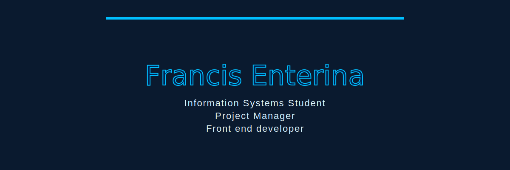

  

  

  <b>CYBER / RETRO MODE:</b> building, shipping, iterating ⚡

  

<h2 align="center">🎛️ Now Playing</h2>

  

<h2 align="center">🔥 Currently Building</h2>

  

  <b>Red Carpet</b> — Mobile Wedding Marketplace (React Native + Supabase) 
  <b>USB Ear Endoscope</b> — Screening + Reliability Study Tool 
  <b>Weekly Practice Apps</b> — Small builds that ship

  

<h2 align="center">🚀 Featured Projects</h2>

  
  

  

  

<h2 align="center">⚙️ Core Stack</h2>

  
  
  
  
  
  

  

<h2 align="center">📊 Momentum</h2>

  
  

  

  

<h2 align="center">⚡ Activity Feed</h2>

  

  

<h2 align="center">🌍 Connect</h2>

  
  
  
  

 

  

